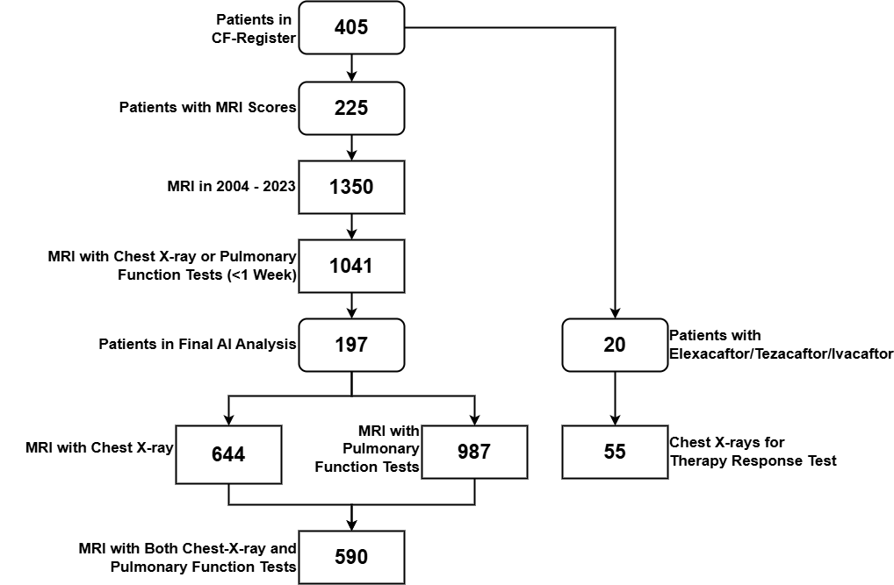
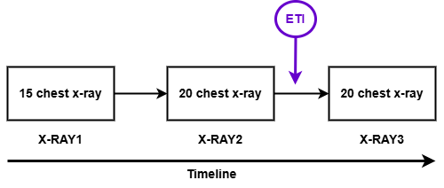
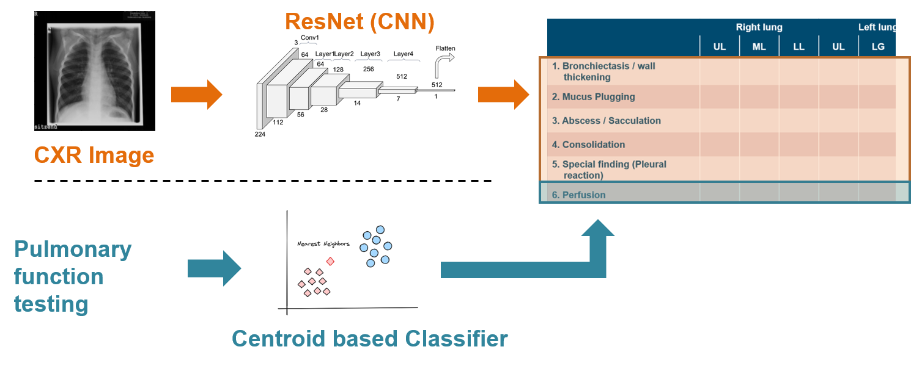

# Deep-CXR-Score

This repository describes the methodology used to develop **Deep-CXR-Score**, a hybrid AI system that predicts visual chest MRI scores in cystic fibrosis (CF) using frontal chest x-ray and pulmonary function tests (PFT).

---

## Study population

### Study flowchart

> **Study flowchart.** Please note that more than 95% of patients/their parents or legal guardians referred to our center.

### Ethics

This observational retrospective study (ClinicalTrials.gov identifiers: **NCT00760071**, **NCT02270476**) was approved by the institutional ethics committee of the University of Heidelberg (**S-211/2011**, **S-370/2011**). It included all pediatric and adult patients with CF (mean age 9.2 ± 6.1 years, range 0–35 years) who underwent clinically indicated chest MRI and chest x-ray, or PFT, concurrently at our center between **2006 and 2023**. Some patients were included in previous reports; however, those studies did not include chest x-ray or deep learning analysis (see thesis references: 8, 9, 11, 13, 16).

### Recruitment

In total, **197** patients were included (see Figure above). More than **95%** of approached patients (or parents/legal guardians) consented to participation. **126** CF patients were identified by newborn screening (thesis reference: 37). Diagnosis was confirmed by increased sweat chloride concentration (≥ 60 mmol/L) and CFTR mutation analysis. In pancreatic-sufficient patients with borderline sweat chloride values (30–60 mmol/L), CFTR function was assessed in rectal biopsies as previously described (thesis reference: 38).

Because contrast material was not routinely administered in infants per protocol, and because some parents refused its use in older participants, the MRI perfusion score was available for **923 MRI examinations (88.6%)** (Table 1).

---

## Patient characteristics

### Table 1. Characteristics of patients for deep learning and centroid classifier

> **Note:** GitHub Markdown tables do not support multi-row/multi-column headers well. The table below is flattened but preserves the values.

| Variable | DL Train | DL Val | DL Test | DL P | PFT Train | PFT Test | PFT P | Combined Total |
|---|---:|---:|---:|---:|---:|---:|---:|---:|
| Patients, n (%) | 126 (79%) | 16 (10%) | 17 (11%) | — | 177 (92%) | 16 (8%) | — | 197 |
| Sex (m / f) | 67 / 59 | 10 / 6 | 13 / 4 | — | 90 / 87 | 12 / 4 | — | 105 / 92 |
| MRI examinations, n | 501 | 77 | 66 | — | 892 | 95 | — | 1041 |
| Average MRI contribution | 4.0 ± 2.3 | 4.8 ± 2.1 | 3.9 ± 2.7 | — | 5.0 ± 3.4 | 5.9 ± 3.3 | — | 5.3 ± 3.7 |
| Age (yrs) | 5.4 ± 6.1 | 5.6 ± 5.9 | 7.2 ± 9.1 | 0.19 | 7.8 ± 8.8 | 7.1 ± 8.4 | 0.08 | 7.5 ± 8.9 |
| Age range (yrs) | 0.1–20.9 | 0.1–18.2 | 0.1–29.2 | — | 0.1–35.3 | 0.1–29.2 | — | 0.1–35.3 |
| Height (cm) | 101.2 ± 39.3 | 104.2 ± 38.0 | 101.2 ± 48.9 | 0.04 | 108.9 ± 41.0 | 109.1 ± 44.4 | 0.23 | 105.7 ± 42.2 |
| Height range (cm) | 49.5–183.2 | 57.8–164.0 | 53.0–182.0 | — | 48.5–195.0 | 53.0–179.0 | — | 48.5–195.0 |
| Weight (kg) | 21.1 ± 18.6 | 20.3 ± 16.2 | 22.5 ± 23.9 | 0.04 | 24.1 ± 19.6 | 24.6 ± 22.7 | 0.08 | 23.2 ± 20.1 |
| Weight range (kg) | 3.11–73.3 | 4.0–53.1 | 3.3–77.0 | — | 2.7–80.0 | 3.3–77.0 | — | 2.7–80.0 |
| BMI (kg/m²) | 15.9 ± 2.5 | 15.8 ± 2.3 | 16.0 ± 3.2 | 0.21 | 16.1 ± 2.6 | 16.4 ± 3.0 | 0.01 | 16.1 ± 2.7 |
| BMI range (kg/m²) | 11.1–27.5 | 12.0–20.2 | 11.8–24.0 | — | 11.1–27.5 | 11.8–24.0 | — | 11.1–27.5 |
| Chest x-ray images, n (%) | 501 (78%) | 77 (12%) | 66 (10%) | — | — | — | — | 644 |
| meanLCI, n (%) | — | — | — | — | 697 (90%) | 78 (10%) | — | 775 |
| meanLCI, mean | — | — | — | — | 9.5 ± 3.7 | 9.0 ± 4.0 | 0.80 | 9.5 ± 3.7 |
| meanLCI, range | — | — | — | — | 5.4–25.7 | 6.2–21.1 | — | 5.4–25.7 |
| ppFEV1, n (%) | — | — | — | — | 654 (91%) | 64 (9%) | — | 718 |
| ppFEV1, mean (%) | — | — | — | — | 81.0 ± 20.1 | 83.9 ± 19.4 | 0.32 | 81.2 ± 20.0 |
| ppFEV1, range | — | — | — | — | 23.5–137.1 | 53.4–116.7 | — | 23.5–137.1 |

**CFTR genotype class, n (%):**

| Genotype | DL Train | DL Val | DL Test | PFT Train | PFT Test | Combined Total |
|---|---:|---:|---:|---:|---:|---:|
| F/F | 56 (44.4%) | 7 (43.8%) | 9 (52.9%) | 80 (45.2%) | 8 (50.0%) | 91 (46.2%) |
| F/MF | 43 (34.1%) | 5 (31.3%) | 1 (5.9%) | 54 (30.5%) | 1 (6.3%) | 56 (28.4%) |
| F/G | 4 (3.2%) | 1 (6.3%) | 0 | 5 (2.8%) | 0 | 5 (2.5%) |
| F/RF | 6 (4.8%) | 0 | 1 (5.9%) | 12 (6.8%) | 1 (6.3%) | 13 (6.0%) |
| F/other | 2 (1.6%) | 0 | 2 (11.8%) | 6 (3.4%) | 2 (12.5%) | 8 (4.0%) |
| MF/MF | 9 (7.1%) | 2 (12.5%) | 1 (5.9%) | 12 (6.8%) | 1 (6.3%) | 13 (6.6%) |
| MF/RF | 2 (1.6%) | 1 (6.3%) | 1 (5.9%) | 3 (1.7%) | 1 (6.3%) | 4 (2.0%) |
| MF/G | 3 (2.4%) | 0 | 1 (5.9%) | 3 (1.7%) | 1 (6.3%) | 4 (2.0%) |
| MF/other | 0 | 0 | 0 | 0 | 0 | 0 |
| RF/RF | 0 | 0 | 0 | 1 (0.6%) | 0 | 1 (0.5%) |
| Other/other | 1 (0.8%) | 0 | 1 (5.9%) | 1 (0.6%) | 1 (6.3%) | 2 (1.0%) |

**Abbreviations:** BMI = body-mass index; CFTR = cystic-fibrosis transmembrane-conductance regulator;  
F = loss-of-function mutation; MF = minimal-function mutation; G = gating mutation; RF = residual-function mutation;  
Values are given as *n* (%), mean ± SD, or range.  
Percentages for Patients, chest x-ray images, LCI (N₂), and ppFEV1 refer to the total number in each experiment; genotype percentages refer to their subgroup.  
Some patients did not undergo 4D perfusion MRI, required for perfusion and global scores.  
Two-group comparisons used Mann–Whitney U; multiple-group comparisons used ANOVA on ranks.

---

## MRI score distribution

### Table 2. Distribution of MRI scores across data groups for deep learning and centroid classification

| Metric | DL Train | DL Val | DL Test | DL P | PFT Train | PFT Test | PFT P | Combined |
|---|---:|---:|---:|---:|---:|---:|---:|---:|
| **MRI global score** | 12.6 ± 7.8 | 13.7 ± 8.8 | 14.1 ± 9.9 | 0.57 | 13.7 ± 8.3 | 13.7 ± 9.3 | 0.99 | 13.7 ± 8.4 |
| Range | 0–41 | 0–42 | 0–42 | — | 0–49 | 0–44 | — | 0–49 |
| Prevalence, n (%) | 501 (97.8) | 77 (96.1) | 66 (95.5) | — | 1061 (98.4) | 115 (97.4) | — | 1176 (98.3) |
| **MRI morphological score** | 8.7 ± 5.4 | 9.5 ± 6.2 | 9.7 ± 7.3 | 0.62 | 9.7 ± 5.8 | 9.8 ± 7.0 | 0.84 | 9.7 ± 5.9 |
| Range | 0–30 | 0–30 | 0–32 | — | 0–39 | 0–33 | — | 0–39 |
| Prevalence, n (%) | 501 (97.4) | 77 (96.1) | 66 (95.5) | — | 1061 (98.0) | 115 (97.4) | — | 1176 (98.0) |
| **MRI perfusion score** | 4.3 ± 2.9 | 4.7 ± 3.3 | 5.1 ± 3.1 | 0.62 | 4.5 ± 3.0 | 4.6 ± 3.1 | 0.68 | 4.5 ± 3.0 |
| Range | 0–12 | 0–12 | 0–12 | — | 0–12 | 0–12 | — | 0–12 |
| Prevalence, n (%) | 449 (88.6) | 69 (91.3) | 57 (93.0) | — | 939 (90.1) | 96 (92.7) | — | 1035 (90.3) |
| **Bronchiectasis / wall thickening** | 5.3 ± 2.2 | 5.6 ± 2.3 | 5.8 ± 2.7 | 0.52 | 5.7 ± 2.1 | 5.8 ± 2.4 | 0.64 | 5.7 ± 2.2 |
| Range | 0–12 | 0–12 | 0–12 | — | 0–12 | 0–12 | — | 0–12 |
| Prevalence, n (%) | 499 (97.8) | 75 (98.7) | 64 (96.9) | — | 1055 (98.6) | 113 (98.2) | — | 1168 (98.5) |
| **Mucus plugging** | 2.4 ± 2.4 | 2.5 ± 2.7 | 2.9 ± 3.0 | 0.88 | 2.7 ± 2.5 | 2.8 ± 2.6 | 0.72 | 2.7 ± 2.5 |
| Range | 0–12 | 0–12 | 0–11 | — | 0–12 | 0–11 | — | 0–12 |
| Prevalence, n (%) | 499 (72.3) | 75 (68.0) | 64 (78.1) | — | 1055 (76.3) | 113 (84.1) | — | 1168 (77.1) |
| **Pleural findings** | 0.6 ± 1.0 | 0.8 ± 1.1 | 0.9 ± 1.3 | 0.86 | 0.8 ± 1.1 | 0.8 ± 1.4 | 0.64 | 0.8 ± 1.2 |
| Range | 0–5 | 0–4 | 0–5 | — | 0–7 | 0–6 | — | 0–7 |
| Prevalence, n (%) | 497 (39.4) | 75 (44.0) | 63 (42.9) | — | 1050 (42.7) | 112 (37.5) | — | 1162 (42.2) |
| **Abscess / sacculation** | 0.1 ± 0.4 | 0.1 ± 0.4 | 0.0 ± 0.3 | 0.47 | 0.1 ± 0.6 | 0.1 ± 0.5 | 0.58 | 0.1 ± 0.5 |
| Range | 0–3 | 0–3 | 0–2 | — | 0–6 | 0–3 | — | 0–6 |
| Prevalence, n (%) | 496 (5.4) | 75 (4.0) | 63 (3.2) | — | 1050 (7.1) | 112 (4.4) | — | 1164 (6.9) |
| **Consolidations** | 0.4 ± 0.8 | 0.7 ± 1.1 | 0.5 ± 1.1 | 0.01 | 0.5 ± 1.0 | 0.5 ± 1.2 | 0.62 | 0.5 ± 1.0 |
| Range | 0–5 | 0–5 | 0–4 | — | 0–8 | 0–5 | — | 0–8 |
| Prevalence, n (%) | 497 (25.1) | 75 (42.7) | 63 (20.6) | — | 1053 (27.8) | 112 (22.3) | — | 1165 (27.3) |

Values are given as mean ± SD, range, or *n* (%). Prevalence percentages refer to the total number of MRI examinations in each experiment. Some patients lacked 4D perfusion MRI.

---

## Dataset split and cohorts

The population was split into two subgroups for separate analyses:

- **Subgroup 1 (Chest x-ray + MRI score):**  
  644 chest x-rays paired with same-day chest MRI (mean time difference −0.2 ± 0.7 days, range 0–2 days) from 159 CF patients. Data were divided into training/validation/test sets at 80%/10%/10%, with balancing across number of images, age distribution, and MRI score distribution (global and component scores; Table 1).

- **Subgroup 2 (PFT + MRI score):**  
  987 MRI scans with same-day PFT from 193 patients (LCI: 0.1 ± 0.2 days, range 0–3 days; FEV1: 0.1 ± 0.1 days, range 0–2 days). Data were split into training/test at 90%/10%. All patients in the test group of the chest x-ray subgroup were also included in the PFT subgroup test set (Table 1).

### Chest x-ray sequence for therapy response test

To validate therapy responsiveness, an additional cohort of **20 adults with CF** not used for training was analyzed (mean age 29.8 ± 5.9 years; range 19.8–43.2 years). Each had a frontal chest x-ray obtained on average **12.2 ± 10.5 months** before starting ETI therapy. A follow-up chest x-ray was acquired after ETI initiation (months from X-RAY1: 31.6 ± 10.9 months, range 12.1–52.4). The mean ETI exposure at that scan was 19.4 ± 10.2 months (range 0.8–37.1). Fifteen patients also had an earlier x-ray acquired 21.8 ± 14.0 months (range 2.5–51.4) before X-RAY2, when they were not yet receiving ETI. This longitudinal series of up to three x-rays per patient was used to evaluate pre-ETI baseline and post-therapy changes.

---

## Therapy regimes

All patients were followed at the CF center at the University Hospital Heidelberg. Standard of care followed the European Best Practice Guidelines, including physiotherapy for airway clearance, inhalation with isotonic or hypertonic saline from diagnosis, and substitution of pancreatic enzymes and fat-soluble vitamins in pancreatic-insufficient patients. With worsening respiratory symptoms or increasing MRI scores, inhaled dornase alfa was added. Detection of *Pseudomonas aeruginosa* triggered eradication-focused antibiotic treatment. Other pathogens were generally treated with oral antibiotics if respiratory symptoms were present; no antibiotic prophylaxis was given (thesis references: 39, 40).

In the AI development cohort:

- 4 patients received ivacaftor since 2013 (11 MRI examinations affected).
- 23 patients (≥6 years) homozygous or heterozygous for F508del received ivacaftor/tezacaftor (32 examinations affected).
- 23 patients (≥6 years) homozygous for F508del received lumacaftor/ivacaftor since late 2015 in Europe, and an additional 29 patients (≥2 years) since 2019, affecting 98 MRI examinations total.
- MRI scans from 5 patients receiving highly effective triple CFTR modulator therapy were excluded (6 MRI examinations excluded).

For the therapy-response validation cohort, all 20 patients received standard therapy before X-RAY1 and then received ETI therapy in addition between X-RAY2 and X-RAY3.

---

## Pulmonary function tests

Multiple-breath washout (MBW) was performed on the same day as MRI using the *Exhalyzer D* system (Eco Medics, Dürnten, Switzerland), employing 100% oxygen to wash out resident nitrogen (N₂) through a mouthpiece interface (thesis reference: 21). Data were analyzed using *Spiroware 3.3.1* to compute LCI (thesis references: 22, 48). Children < 5 years who were sedated with chloral hydrate underwent MRI and MBW in the same session.

Full-body plethysmography and/or spirometry (*MasterScreen Body*, E. Jaeger) were performed on the same day as MRI following ERS/ATS standards; ppFEV1 was computed accordingly (thesis references: 49, 50).

Before AI-based analyses, dataset-based z-score normalization was applied to LCI and ppFEV1.

---

## Image acquisition and assessment

### MRI

Standardized chest MRI was performed after diagnosis or referral starting at ~3 months of age and then annually. Imaging was performed using three similar 1.5 T scanners from the same manufacturer (Magnetom Symphony, Magnetom Avanto, Magnetom Aera; Siemens Healthineers, Erlangen, Germany). Protocols were kept constant over the study period apart from minor adaptations to software versions (thesis references: 31, 20, 28, 29, 42, 43, 44, 23, 32, 46, 47).

In brief, T1-weighted sequences before and after IV contrast and T2-weighted sequences before contrast were acquired. Four-dimensional lung perfusion imaging used macrocyclic gadolinium-based contrast agents (0.1 mmol/kg body weight of gadobutrol or gadoteric acid) injected at 3–5 ml/s. Children ≤ 5 years were routinely sedated with oral or rectal chloral hydrate (100 mg/kg, max 2 g) and monitored with MR-compatible pulse oximetry. Renal function was checked before contrast administration. Contrast required for 4D perfusion imaging was avoided in infancy due to prescription regulations.

All MRI examinations were assessed by the same validated reader (MOW) using the established scoring system (thesis references: 31, 20, 28, 29, 42, 43, 44, 23, 32, 46, 47, 25). Prior MRI results were available to the reader for comparison. Each lobe and the lingula were scored as 0 (absent), 1 (<50% involved), or 2 (≥50% involved) for bronchiectasis/wall thickening, mucus plugging, sacculation/abscess, consolidation, special finding/pleural lesion, and perfusion abnormalities. Morphology items sum to the MRI morphology score, perfusion abnormalities sum to the MRI perfusion score, and both sum to the MRI global score (0–72).

### Chest x-ray

All chest x-rays were acquired in either posterior–anterior or anterior–posterior projection. Chest x-rays used for ETI evaluation were scored using the modified Chrispin–Norman score (frontal view only) by the same reader (MOW) (thesis references: cn_1, cn_2).

The modified Chrispin–Norman score grades CF lung damage on a single frontal film. The image is divided into four lung quadrants. Four radiographic features are assessed—bronchial line (tram-track) shadows, ring shadows, mottled (nodular) shadows, and large soft shadows representing consolidation or atelectasis. Each feature is scored per quadrant on a 3-point scale (0 = absent, 1 = mild, 2 = marked), yielding a maximum of 32 points.

---

## Image preprocessing

Image preprocessing consisted of two main steps: chest x-ray size normalization and ROI selection. FFT-based resizing was used for normalization. ROI selection included lung region cropping and separation of left and right lung regions; both were performed using two trained nnU-Net models (thesis references: 33, 51).

### Chest x-ray ROI selection

Chest x-rays contained non-patient regions (e.g., markers, black borders, window artifacts) that could negatively affect downstream lung-halves segmentation. An automatic ROI selection pipeline was implemented using nnU-Net. The model was trained with 12 manually selected ROI bounding boxes and then applied to automatically select ROIs for the remaining ~600 chest x-rays.

### Lung halves segmentation in chest x-ray

An initial nnU-Net was trained on the open-source Montgomery County chest x-ray dataset (138 frontal films; 17 from patients <18 years). Performance was evaluated on 24 internal films (6 each from age bands 0–1, 1–6, 6–12, and 12–19 years). Three preprocessing schemes were evaluated to improve segmentation: global histogram equalization, CLAHE, and simple intensity remapping. A radiologist (LW) manually delineated 30 pediatric chest x-rays from the internal archive, and a new nnU-Net was retrained using the combined pediatric + Montgomery images.

---

## Hybrid AI scoring model

The study comprised two components:

- A **ResNet-50** model predicting item-level visual MRI scores from a single frontal chest x-ray.
- A **centroid-based classifier** using PFT parameters transformed into a 13-level quantitative scale, providing an independent “backup” estimate for MRI perfusion-related severity.

### Deep learning chest x-ray–predicted MRI score system

Because the MRI scoring system is defined at lobar level, score items were treated independently by lobe. Due to limited lobar information in frontal x-rays, paired lung-half x-rays and corresponding MRI scores were generated and used to predict the target scoring system.

#### ResNet-50 training

A modified ResNet-50 architecture (thesis reference: 34) was trained on a single NVIDIA RTX 3060 GPU. The model was fitted on the training set, tuned on the validation set to select the best checkpoint, and evaluated on an independent test set. The model outputs lobar-level MRI scores for bronchiectasis/wall thickening, sacculation/abscess, mucus plugging, consolidation, special findings, and perfusion.

#### Modified architecture

The model begins with an 11×11 convolution followed by 3×3 max pooling, passes through the four standard ResNet stages of residual blocks, and ends with global average pooling and a fully connected regression head.

#### Input and output

Left and right lungs were analyzed separately. Each input is a 512×512 chest x-ray containing a single lung half. Instance-based min–max interval adjustment and z-score normalization were applied during training. The network outputs a 3×6 matrix (three lobes: upper, middle/lingula, lower; six pathological features), yielding lung-half lobar CF severity scores.

#### Loss function

A combined loss was used to balance pointwise accuracy and agreement with summed MRI scores:

\[
L_C = \alpha L_E + \beta L_P + \gamma L_{\rho}, \qquad
\alpha,\beta,\gamma>0,\ \alpha+\beta+\gamma=1.
\]

Where:

- Cross-entropy loss:

\[
L_E = -\frac{1}{N}\sum_{i=1}^{N}\left[
y_i \ln x_i + (1-y_i)\ln(1-x_i)
\right]
\]

- Pearson-correlation loss:

\[
L_P = 1-\mathrm{corr}_P(x,y)
= 1-\frac{\sum_{i=1}^{N}(x_i-\bar x)(y_i-\bar y)}
{\sqrt{\sum_{i=1}^{N}(x_i-\bar x)^2}\sqrt{\sum_{i=1}^{N}(y_i-\bar y)^2}}
\]

- Spearman-correlation loss (with ranks \(r_i=\mathrm{rank}(x_i)\), \(s_i=\mathrm{rank}(y_i)\)):

\[
L_{\rho} = 1-\mathrm{corr}_S(x,y)
= 1-\frac{\sum_{i=1}^{N}(r_i-\bar r)(s_i-\bar s)}
{\sqrt{\sum_{i=1}^{N}(r_i-\bar r)^2}\sqrt{\sum_{i=1}^{N}(s_i-\bar s)^2}}
\]

Weights were tuned on the validation set; the final model used \(\alpha=0.5\), \(\beta=0.3\), \(\gamma=0.2\), emphasizing classification error while enforcing linear and ordinal agreement with MRI reference scores.

#### Optimizer and learning-rate schedule

AdamW (thesis reference: adam) was used with step-decay learning-rate scheduling. The best initial learning rate in this study was 0.0003.

#### Visualization of activation maps (Grad-CAM)

Grad-CAM was used to visualize model attention (thesis reference: 52). The pretrained ResNet-50 was run on all test-set x-rays, attention maps were computed from the fourth convolutional layer (feeding lobar predictions), and maps were aligned, normalized, and averaged across the test cohort to create a composite activation map.

### Centroid-based PFT-predicted MRI perfusion score

A centroid classifier clustered PFT measurements into 13 groups. New observations were assigned to the nearest training centroid using Euclidean distance. Because clinical records included three patterns—(1) both ppFEV1 and LCI, (2) ppFEV1 only, (3) LCI only—separate centroid classifiers were trained and tested for each scenario, allowing selection based on available PFT data.

### Hybrid-predicted score combining chest x-ray and PFT

The final system integrates both approaches. The ResNet-50 provides primary predictions from chest x-ray. When at least one lung function metric (LCI or ppFEV1) is available, the centroid classifier is used to estimate MRI perfusion score as a complementary component. Reported hybrid results include only cases where the MRI score corresponds with both chest x-ray and at least one PFT metric.

---

## Statistical analyses

A 3-class F1 score was used to evaluate lobar-level prediction quality:

\[
0.10-0.50=\text{not good},\quad
0.50-0.80=\text{ok},\quad
0.80-0.90=\text{good},\quad
0.90-1.00=\text{very good}.
\]

Agreement between predicted and reference lobar scores was assessed using **linear weighted Cohen’s kappa**:

\[
\le 0=\text{no agreement},\quad
0.01-0.20=\text{none to slight},\quad
0.21-0.40=\text{fair},\quad
0.41-0.60=\text{moderate},\quad
0.61-0.80=\text{substantial},\quad
0.81-1.00=\text{almost perfect agreement}.
\]

Spearman rank correlation \(\rho\) was used to compare predicted and reference summary scores, interpreted as:

\[
0.10-0.39=\text{weak},\quad
0.40-0.69=\text{moderate},\quad
0.70-0.89=\text{strong},\quad
0.90-1.00=\text{very strong}
\]
(thesis reference: 35).

Group comparisons used Mann–Whitney U tests; score changes were assessed via ANOVA on ranks and Wilcoxon signed-rank tests. Statistical significance was set at **P < 0.05**. Multiple-comparison correction (e.g., Bonferroni–Holm) was applied as appropriate.
