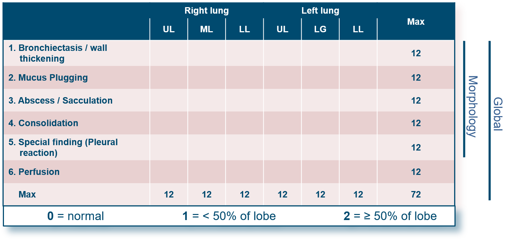
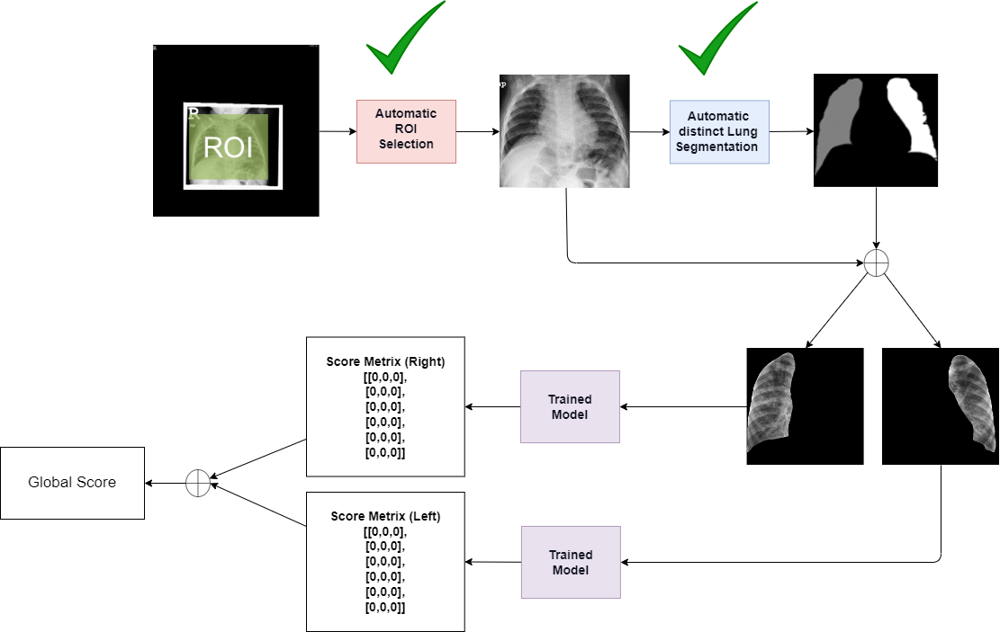
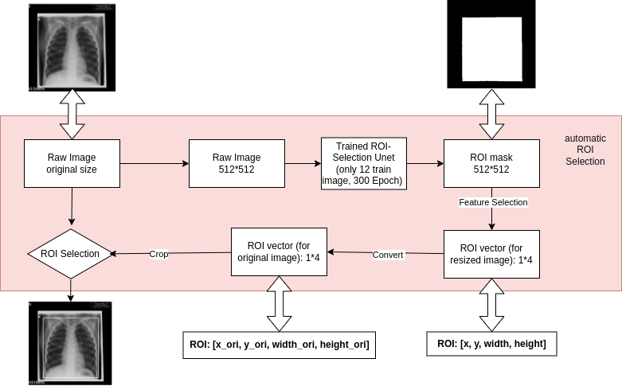
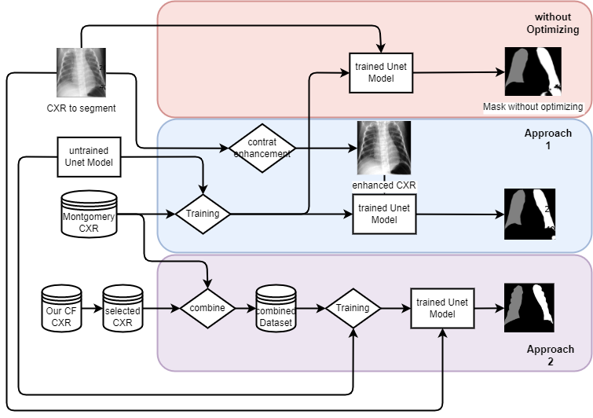
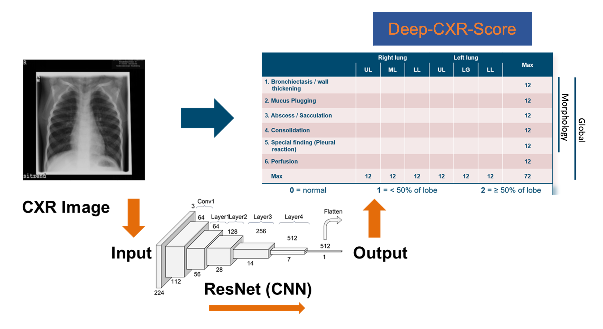

# Deep-CXR-Score

This repository describes the methodology used to develop **Deep-CXR-Score**, a hybrid AI system that predicts visual chest MRI scores in cystic fibrosis (CF) using frontal chest x-ray and pulmonary function tests (PFTs).

---

## Image acquisition and assessment

All data was acquired at two different sites within the same institution, the Children’s Hospital at University Hospital Heidelberg, caring for PwCF of minor age, and the Thoraxklinik at University Hospital Heidelberg, caring for adult PwCF.

### MRI

Standardized chest MRI was performed after diagnosis or referral starting at ~3 months of age and then annually. Imaging was performed using three similar 1.5 T scanners from the same manufacturer (Magnetom Symphony, Magnetom Avanto, Magnetom Aera; Siemens Healthineers, Erlangen, Germany). Protocols were kept constant over the study period apart from minor adaptations to software versions.

In brief, T1-weighted sequences before and after IV contrast and T2-weighted sequences before contrast were acquired. Four-dimensional lung perfusion imaging used macrocyclic gadolinium-based contrast agents (0.1 mmol/kg body weight of gadobutrol or gadoteric acid) injected at 3–5 ml/s. Children ≤ 5 years were routinely sedated with oral or rectal chloral hydrate (100 mg/kg, max 2 g) and monitored with MR-compatible pulse oximetry. Renal function was checked before contrast administration. Contrast required for 4D perfusion imaging was avoided in infancy due to prescription regulations.

All MRI examinations were assessed by the same validated reader (MOW) using the established scoring system. Prior MRI results were available to the reader for comparison. Each lobe and the lingula were scored as 0 (absent), 1 (<50% involved), or 2 (≥50% involved) for bronchiectasis/wall thickening, mucus plugging, sacculation/abscess, consolidation, special finding/pleural lesion, and perfusion abnormalities. Morphology items sum to the MRI morphology score, perfusion abnormalities sum to the MRI perfusion score, and both sum to the MRI global score (0–72).

### Chest x-ray

All chest x-rays were acquired in either posterior–anterior or anterior–posterior projection. Chest x-rays used for ETI evaluation were scored using the modified Chrispin–Norman score (frontal view only) by the same reader (MOW).

The modified Chrispin–Norman score grades CF lung damage on a single frontal film. The image is divided into four lung quadrants. Four radiographic features are assessed—bronchial line (tram-track) shadows, ring shadows, mottled (nodular) shadows, and large soft shadows representing consolidation or atelectasis. Each feature is scored per quadrant on a 3-point scale (0 = absent, 1 = mild, 2 = marked), yielding a maximum of 32 points.

---

## Image preprocessing

Image preprocessing consisted of two main steps: chest x-ray size normalization and ROI selection. FFT-based resizing was used for normalization. ROI selection included lung region cropping and separation of left and right lung regions; both were performed using two trained nnU-Net models. Through the application of Fast Fourier Transformation, CXR images were uniformly resized to a resolution of 512x512 pixels. Lung halves were automatically segmented using nnU-Net for the training, validation and testing. The same-day chest MRI scores for individual pathologies were likewise separated by lung halves to enable pairing with the input images.

### Chest x-ray ROI selection

Chest x-rays contained non-patient regions (e.g., markers, black borders, window artifacts) that could negatively affect downstream lung-halves segmentation. An automatic ROI selection pipeline was implemented using nnU-Net. The model was trained with 12 manually selected ROI bounding boxes and then applied to automatically select ROIs for the remaining ~600 chest x-rays.

### Lung halves segmentation in chest x-ray

An initial nnU-Net was trained on the open-source Montgomery County chest x-ray dataset (138 frontal films; 17 from patients <18 years). Performance was evaluated on 24 internal films (6 each from age bands 0–1, 1–6, 6–12, and 12–19 years). Three preprocessing schemes were evaluated to improve segmentation: global histogram equalization, CLAHE, and simple intensity remapping. A radiologist (LW) manually delineated 30 pediatric chest x-rays from the internal archive, and a new nnU-Net was retrained using the combined pediatric + Montgomery images.

---

## Model for Deep-CXR-Score

The study comprised **ResNet-50** model predicting item-level visual MRI scores from a single frontal chest x-ray.

### Deep learning score chest x-ray with same-day MRI score as ground truth

Because the MRI scoring system is defined at lobar level, score items were treated independently by lobe. Due to limited lobar information in frontal x-rays, paired lung-half x-rays and corresponding MRI scores were generated and used to predict the target scoring system.

#### ResNet-50 training

A modified ResNet-50 architecture was trained on a single NVIDIA RTX 3060 GPU. The model was fitted on the training set, tuned on the validation set to select the best checkpoint, and evaluated on an independent test set. The model outputs lobar-level MRI scores for bronchiectasis/wall thickening, sacculation/abscess, mucus plugging, consolidation, special findings, and perfusion.

#### Modified architecture

The model begins with an 11×11 convolution followed by 3×3 max pooling, passes through the four standard ResNet stages of residual blocks, and ends with global average pooling and a fully connected regression head.

#### Input and output

Left and right lungs were analyzed separately. Each input is a 512×512 chest x-ray containing a single lung half. Instance-based min–max interval adjustment and z-score normalization were applied during training. The network outputs a 3×6 matrix (three lobes: upper, middle/lingula, lower; six pathological features), yielding lung-half lobar CF severity scores.

#### Loss function

A combined loss was used to balance pointwise accuracy and agreement with summed MRI scores:

$$
L_C = \alpha L_E + \beta L_P + \gamma L_{\rho}, \qquad
\alpha,\beta,\gamma>0,\ \alpha+\beta+\gamma=1.
$$

Where:

- Cross-entropy loss:

$$
L_E = -\frac{1}{N}\sum_{i=1}^{N}\left[
y_i \ln x_i + (1-y_i)\ln(1-x_i)
\right]
$$

- Pearson-correlation loss:

$$
L_P = 1-\mathrm{corr}_P(x,y)
= 1-\frac{\sum_{i=1}^{N}(x_i-\bar x)(y_i-\bar y)}
{\sqrt{\sum_{i=1}^{N}(x_i-\bar x)^2}\sqrt{\sum_{i=1}^{N}(y_i-\bar y)^2}}
$$

- Spearman-correlation loss (with ranks $r_i=\mathrm{rank}(x_i)$, $s_i=\mathrm{rank}(y_i)$):

$$
L_{\rho} = 1-\mathrm{corr}_S(x,y)
= 1-\frac{\sum_{i=1}^{N}(r_i-\bar r)(s_i-\bar s)}
{\sqrt{\sum_{i=1}^{N}(r_i-\bar r)^2}\sqrt{\sum_{i=1}^{N}(s_i-\bar s)^2}}
$$

Weights were tuned on the validation set; the final model used \(\alpha=0.5\), \(\beta=0.3\), \(\gamma=0.2\), emphasizing classification error while enforcing linear and ordinal agreement with MRI reference scores.

#### Optimizer and learning-rate schedule

AdamW (thesis reference: adam) was used with step-decay learning-rate scheduling. The best initial learning rate in this study was 0.0003.

## Statistic
3 classes F1 score has been chosen to evaluate the quality of prediction in lobar level which can be interpreted as follows: 0.10 - 0.50 = not good, 0.50 - 0.80 = ok, 0.80 - 0.90 = good, 0.90 - 1.00 = very good. To evaluate the agreement between predicted score and MRI scores in lobar level, linear weighted Cohen’s Kappa κ has been employed and can be interpreted as follows: ≤ 0 = no agreement, 0.01–0.20 = none to slight, 0.21–0.40 = fair, 0.41– 0.60 = moderate, 0.61–0.80 = substantial, and 0.81–1.00 = almost perfect agreement. Loss function combined cross entropy and correlation loss function has been chosen to quantify the difference between predict and target. The Spearman rank correlation coefficient ρ was calculated for measurements of agreement between predicted summary scores vs. MRI summary scores, and interpreted as follows: 0.10 - 0.39 = weak, 0.40 - 0.69 = moderate, 0.70 - 0.89 = strong, 0.90 - 1.00 = very strong. Comparison between groups was performed by Wilcoxon signed rank test. A P-value <0.05 was considered statistically significant considering corrections for multiple testing. Please note that all analyses involving the Deep-CXR-Score were performed exclusively in the test dataset. Analyses only among MRI scores, Chrispin–Norman scores, and pulmonary function tests were conducted in the combined validation and test cohorts.

## Supplementary Results

**Supplemental Figure 1. Patient-level correlation of chest X-ray (CXR) based scores with chest magnetic resonance imaging (MRI) scores and pulmonary function testing.** 
*Density regression plots for the Chrispin-Norman score vs. MRI global score (A), the composite Deep-CXR-Score vs. MRI global score (B), Deep-CXR-Score for morphology vs. MRI morphology score (C), Deep-CXR-Score for perfusion vs. MRI perfusion score (D), Deep-CXR-Subscore for bronchiectasis/wall thickening vs. MRI bronchiectasis/wall thickening subscore (E) and Deep-CXR-Subscore for mucus plugging vs. MRI mucus plugging subscore (F) are shown at the patient level. Density regression plots for Chrispin-Norman score (G, I) and Composite Deep-CXR-Score (H, J) vs. forced expiratory volume in one second (ppFEV1) (G, H) and lung clearance index (LCI) (I, J) are shown at patient level. Individual Spearman rank correlation coefficient ρ and respective P-value are given for each panel. Opacity of grey reflects the estimated probability density (2D KDE), not raw frequency; darker areas denote higher estimated density.*

In the test cohort, ICC was 0.68 for the composite Deep-CXR-Score. In the combined test and validation cohorts, ICCs were 0.53 for the MRI global score, 0.73 for the Chrispin–Norman score, 0.86 for ppFEV1, and 0.64 for LCI.

Fisher’s r-to-z transformation and Setiger’s test showed that the correlation of the composite Deep-CXR-Score with the MRI global score was significantly improved compared to the Chrispin-Norman score (Z=2.05, P<0.05).
In patient level analyses, the composite Deep-CXR-Score showed strong correlation with the MRI global score (ρ=0.85, P<0.001). By comparison, the Chrispin-Norman score correlated moderately with the MRI global score (ρ=0.65, P<0.001). 

Fisher’s r-to-z transformation and Setiger’s test confirmed that the correlation of the composite Deep-CXR-Score with ppFEV1 (Z=-3.28, P<0.001) and LCI (Z=2.38, P<0.01) was significantly improved compared to the Chrispin-Norman score.
In patient level analyses, the composite Deep-CXR-Score correlated strongly with ppFEV1 (ρ=-0.77, P<0.01) and LCI (ρ=0.74, P<0.005). By comparison, the Chrispin-Norman score showed a moderate correlation with ppFEV1 (ρ=-0.63, P<0.005) and LCI (ρ=0.58, P<0.005). The MRI global score correlated moderate with ppFEV1 (ρ=-0.68, P<0.001) but strongly with LCI (ρ=0.85, P<0.001).

